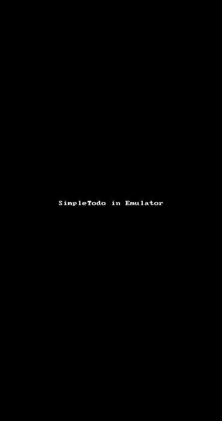

# Project 2 - *Flixster*

**Flixster** shows the latest movies currently playing in theaters. The app utilizes the Movie Database API to display images and basic information about these movies to the user.

Time spent: **6** hours spent in total

## User Stories

The following **required** functionality is completed:

* [X] User can **scroll through current movies** from the Movie Database API

The following **optional** features are implemented:

* [X] For each movie displayed, user can see the following details:
  * [X] Title, Poster Image, Overview (Portrait mode)
  * [X] Title, Backdrop Image, Overview (Landscape mode)
* [X] Display a nice default [placeholder graphic](https://guides.codepath.com/android/Displaying-Images-with-the-Glide-Library#advanced-usage) for each image during loading
* [ ] Allow user to view details of the movie including ratings and popularity within a separate activity
  * [X] Allows user to view rating on the same screen
* [X] Improved the user interface by experimenting with styling and coloring.
* [ ] Apply rounded corners for the poster or background images using [Glide transformations](https://guides.codepath.com/android/Displaying-Images-with-the-Glide-Library#transformations)
* [ ] Apply the popular [Butterknife annotation library](http://guides.codepath.com/android/Reducing-View-Boilerplate-with-Butterknife) to reduce boilerplate code.
* [ ] Allow video trailers to be played in full-screen using the YouTubePlayerView from the details screen.

The following **additional** features are implemented:

* [ ] List anything else that you can get done to improve the app functionality!
  * [ ] Add release date in the main view
  * [ ] Allow user to view a link directly to the movie website (the API didn't provide this, so it'd be hard to find)
  * [ ] Have a next-level control of the UI: Display different movies in different ways, take full control of the space (a lot of blank spaces), and use borders (I didn't search far, but I didn't find a way to manipulate borders the way it's done in CSS).
  * [ ] Allow users to rate movies, which adds more interaction in the app (just like in Netflix!).

## Video Walkthrough

Here's a walkthrough of implemented user stories:

I apologize for the rotated screen. I didn't anticipate it when I started the GIF.

GIF created with [LiceCap](http://www.cockos.com/licecap/).

## Notes

Describe any challenges encountered while building the app.
- Setting the rating took me a while, but I figured it out. I started off searching in the wrong place. However, when I moved to StackOverflow (which I should have done earlier), I was able to find out what to do much quickier (<- IDK if that's a word...). 
- I didn't realize that I could just add a block of Relative, Linear, or other Layout AND add stuff in that layout (Like, nesting them!). That was cool, and I used it to display the pages and buttons at the bottom of the app.

## Open-source libraries used

- [Android Async HTTP](https://github.com/loopj/android-async-http) - Simple asynchronous HTTP requests with JSON parsing
- [Glide](https://github.com/bumptech/glide) - Image loading and caching library for Android

## License

    Copyright [2017] [Robert M. Vunabandi]

    Licensed under the Apache License, Version 2.0 (the "License");
    you may not use this file except in compliance with the License.
    You may obtain a copy of the License at

        http://www.apache.org/licenses/LICENSE-2.0

    Unless required by applicable law or agreed to in writing, software
    distributed under the License is distributed on an "AS IS" BASIS,
    WITHOUT WARRANTIES OR CONDITIONS OF ANY KIND, either express or implied.
    See the License for the specific language governing permissions and
    limitations under the License.
